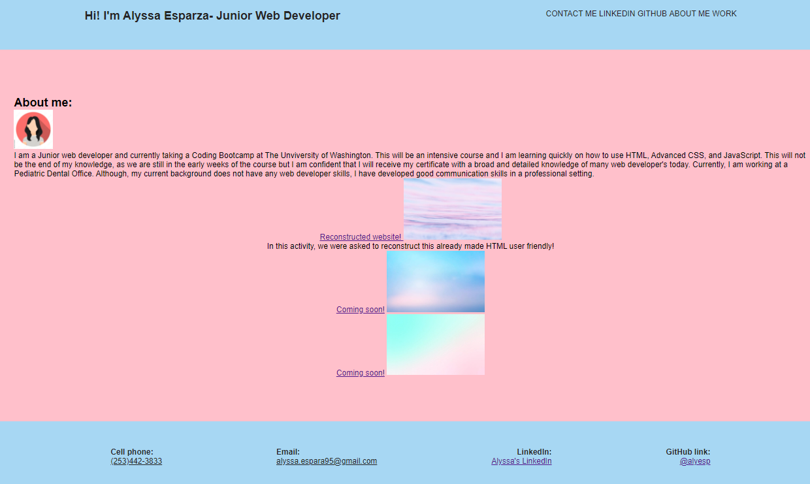

<h1>Portfolio for potentional Jobs</h1>

<h2>This is my first portfolio for potentional interviewers!</h2>

Acceptence criteria for any job, would be to show off my skills as a Junior Web Developer! I have about 3 weeks of HTML and CSS training and I have put these skills into making a work portfolio. At this time, I do not have enough work to place in this work portfolio. I will be adding to this portfolio in the next few months as I learn more about this field, but for now- I have "coming soon!" on 2 Pictures.

I do have a reconstrcued HTM/CSS assignment that we completed, so I decided to add that into my work portfolio. In this assignment, we were asked to reconstruct an exsiting HTML/CSS file and make it into senmatic format, make it user friendly by adding Media Queries and to make the HTML easier for people to read when touching up code for future web developer's (if needed to update). 

In this weeks activity, we were asked to create a HTML/CSS file from scratch.
<h2>Acceptence Criteria:</h2>
<li>Add a recent photo or avator, add links to for contact information, our work, and an about me section.</li>
<li>When you click on the links the in the navigation bar, then you are taken to parts of the page to correspond to the sections on the page. </li>
<li>When the cursor is over an image about or previous work, then the picture is larger than the rest of the our pictures</li>
<li>When an image our our work is clicked, then you are brought to the deployed web application.</li>
<li>The page needed to be resized for various screens and devices, for a responsive layout that adapts to a veiwport.</li>

<h2>SCREENSHOT:<h2>

<h3>Link to deployed website:</h3>
https://alyesp.github.io/Mod2port/
